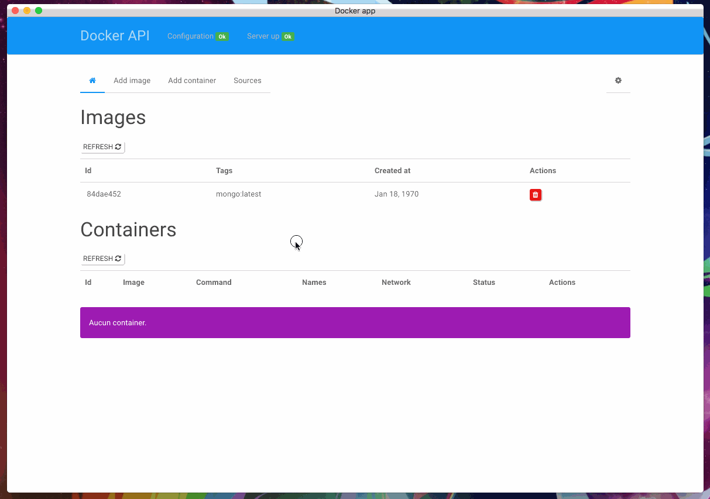

# DOCKER APPLICATION

An application to manage docker server

## INSTALLATION
* Install docker api ([link](https://github.com/kevinbalicot/docker-api)) on your server

```
& npm run build
& npm start
```

Go to config tab and enter ip / port server

Enjoy

## DEMO


